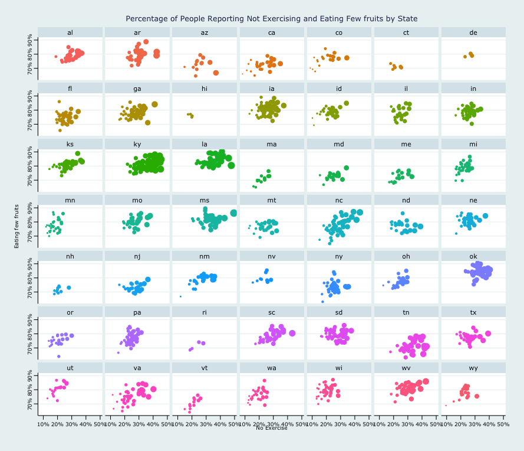
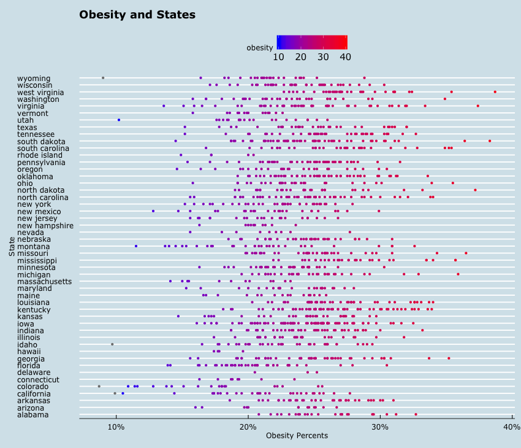
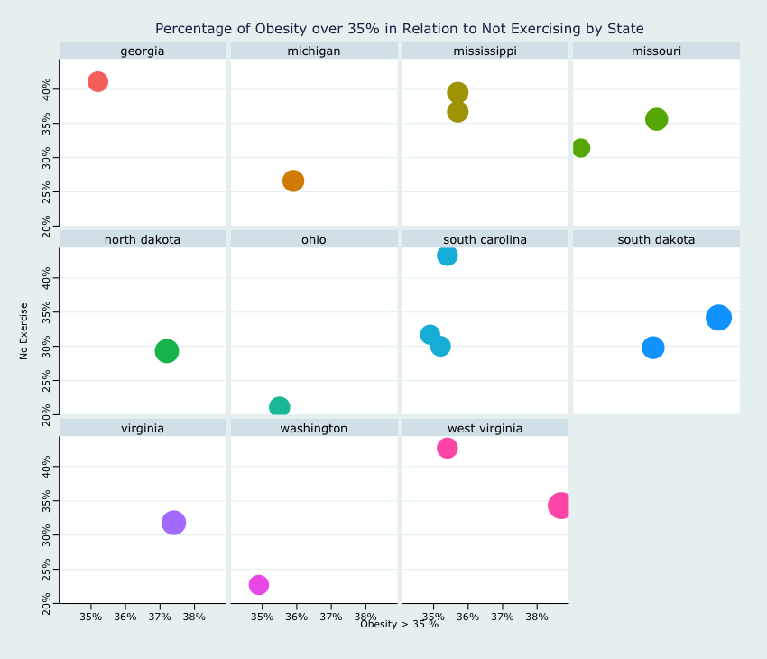
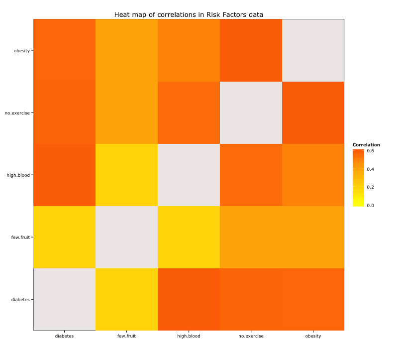
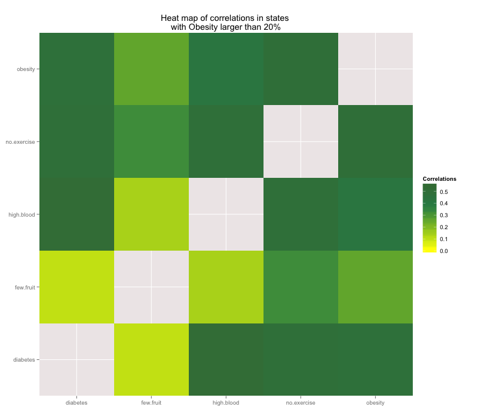
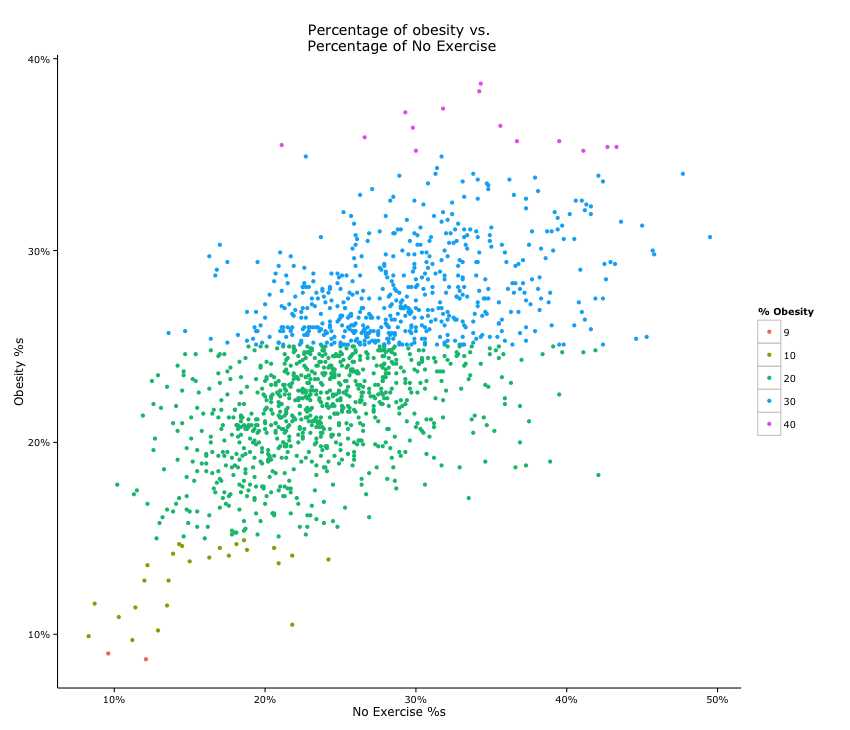
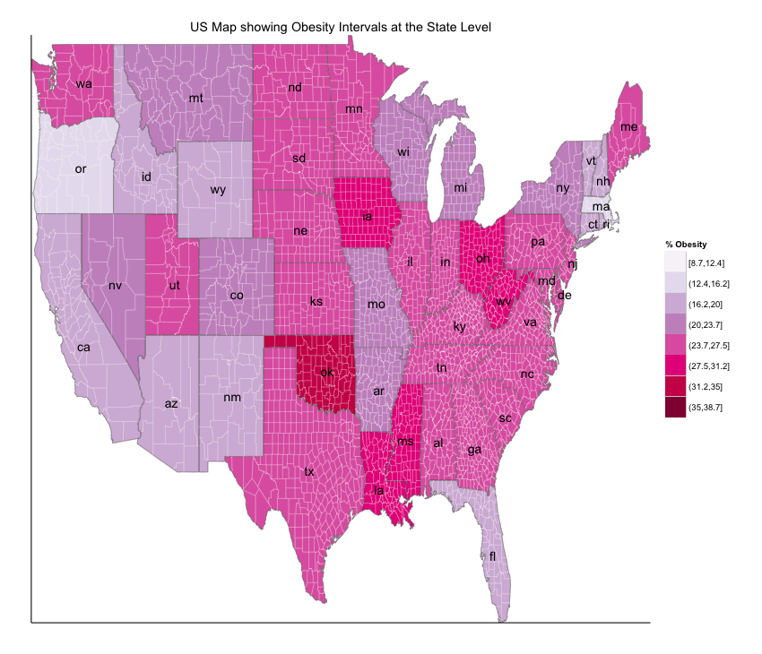
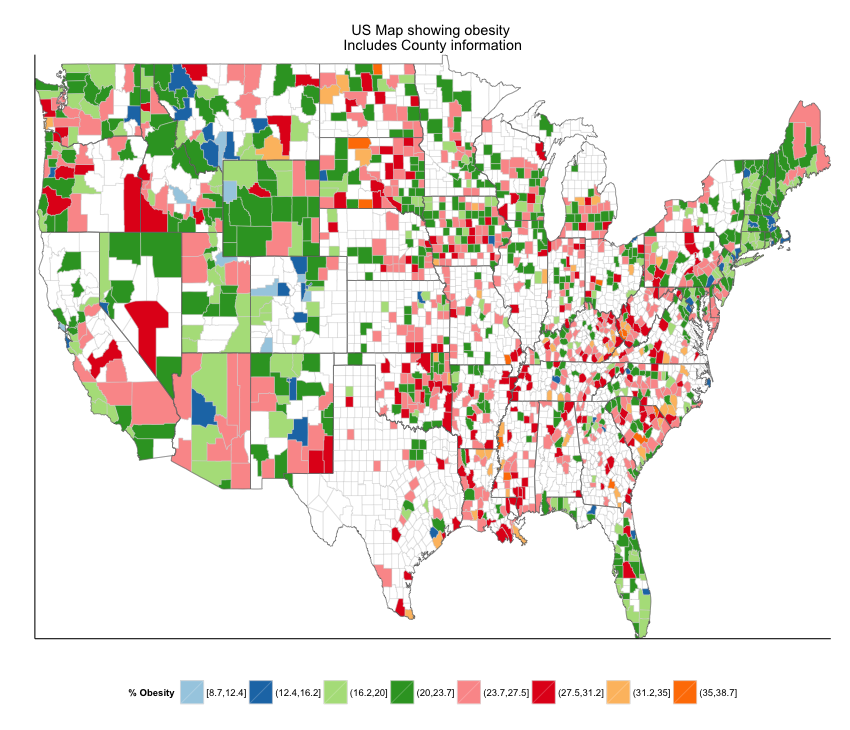

### Project Overview 
For this project I chose to look at the Commumity Health Status Indicators (CHSI) dataset, which is a collection of nationally available indicators for counties representing several areas of responsibility for public health. The goal of the CHSI project is to present a broad set of metrics focused on health at the county level.

#### Data files and Preparation
The CHSI dataset includes many files which measure health indicators based on demographics, leading causes of death, measures of birth and death, preventative services, risk factors and access to care.  After going through the downloaded files and some reading I initially set out to try and work with the following three datasets:
<li> Demographics </li>
<li> Leading Causes of Death </li>
<li> Risk Factors and Access to Care </li>

Data preparation was very time consumming because it involved going through each file to understand the measures presented and select specific aspects and health indicators to focus on. Each file also had missing data: values of -1111 are referred to as 'nfr' or 'no report'and values of '-2222' are referred to as 'nda' or 'no data available'.

| File name  	 | Columns | 
| ---------------|---------|
| Demographics   | 44      | 
| Risk Factors   | 31      |
| Causes of Death| 235     |


#### Assessing the Missingness of Risk Factors dataset:

While the demographics dataset only included one missing value, the risk factors dataset included much more:

| Column  	  		  | Missing| 
| --------------------|--------|
| No Exercise		  | 935    | 
| Obesity     		  | 917    |
| Few Fruits  & Veg   | 1237   |
| High Blood Pressure | 1619   |
| Diabetes            | 422    |

#### Definitions: 

<em> No Exercise </em>: The percentage of adults reporting no participation in any leisure-time physical activities or exercises in the past month.

<em> Obesity </em> : The calculated percentage of adults at risk for health problems related to being overweight, based on body mass index (BMI). A BMI of 30.0 or greater is considered obese. To calculate BMI, multiply weight in lbs by 703 and divide results by height (in inches) squared.

<em> Few Fruits and Vegetables </em>: The percentage of adults reporting an average fruit and vegetable consumption of less than 5 servings per day.

<em> High Blood Pressure </em>: The percentage of adults who responded 'yes' to the question 'Have you ever been told by a doctor, nurse, or health professional that you have high blood pressure?'.
<em> Diabetes </em>: The percentage of adults who responded 'yes' to the question 'Have you ever been told by a doctor that you have diabetest?'.

#### Excerpt of working with the Risk Factors dataset in R:

``` { r chunkLabel echo=FALSE, results='asis', comment =''}

# Load risk data and clean
riskData <- read.csv('~/dev/Rstudio/data/RISKFACTORSANDACCESSTOCARE.csv')
summary(riskData)

# remove first 2 columns and 4th
riskData <- riskData[][-(1:2)]
riskData <- riskData[][-(4)]
#### subset only certain columns
risk_dat <- subset(riskData, select = c(CHSI_County_Name:CHSI_State_Abbr, 
                                        No_Exercise, Few_Fruit_Veg, Obesity, 
                                        High_Blood_Pres, Diabetes, Uninsured))
# change names
nms_risk <- c("county.name","state.name","state.abbr","no.exercise","few.fruit","obesity","high.blood","diabetes","no.ins")
names(risk_dat)<- nms_risk
#### subset data for values >0 to exclude the -1111 and -2222 not reported missing values
risk_dat <- with(risk_dat, subset(risk_dat, (no.exercise>0) & 
                                    (few.fruit>0) & (obesity>0) & (high.blood>0) & 
                                    (diabetes>0) & (no.ins>0)))

# create function to lower, will use on dataframe
lower.df = function(v) 
{
  if(is.character(v)) return(tolower(v)) 
  else return(v)
}
# use lower letters across all dataframes 
risk_dat <- data.frame(lapply(risk_dat, lower.df))
```

## Charts
I used ggplot for all the charts to explore the Risk Factors dataset:

Plot of the percentage of people who reported eating few fruits and not exercising by state.

Since each state has counties, plotting metrics for all states in one graph do not provide clear insight and can be pretty confusing:
Obesity by state in one graph - 

Obesity over 35%:


I explored correlation between different variables and plotted these using heatmaps:

| 			  | no.exercise | few.fruit  | obesity    | high.blood | diabetes   |
|------------ | ------------|------------|------------|------------|------------|
|no.exercise  | 1.0000000   | 0.3955467  | 0.6011213  | 0.5580641  | 0.5781104  |
|few.fruit    | 0.3955467   | 1.0000000  | 0.4081369  | 0.1882816  | 0.1885990  |
|obesity      | 0.6011213   | 0.4081369  | 1.0000000  | 0.5028608  | 0.5707616  |
|high.blood   | 0.5580641   | 0.1882816  | 0.5028608  | 1.0000000  | 0.5992227  |
|diabetes     | 0.5781104   | 0.1885990  | 0.5707616  | 0.5992227  | 1.0000000  |




I then subsetted risk data to explore correlations for which the percentages of obesity was greater than 20%. After removing the less than 20 % obesity data, I found that the top 3 correlations between risk factors are:

* Percent of people with diabetes and percent of people with high blood pressure
* Percent of people who reported not exercising and the percent of people who are obese
* Percent of people who reported not exercising and the percent of people who reported having high blood pressure



I explored scatter plots for obesity and other variables to visualize the clustering between variables. Majority of obesity percentages seem to fall between 20-30, and these correspond to lack in exercise between 20 and 40 percent.



State Level Obesity Map


County Level Obesity Map - a lot of the missing information shows here


### To do
* How to impute data to be able to plot obesity at the county level?
* Explore the other features in the datasets such as race and poverty relating to health indicators
* Explore relationship between population size and features such as poverty and obesity 

